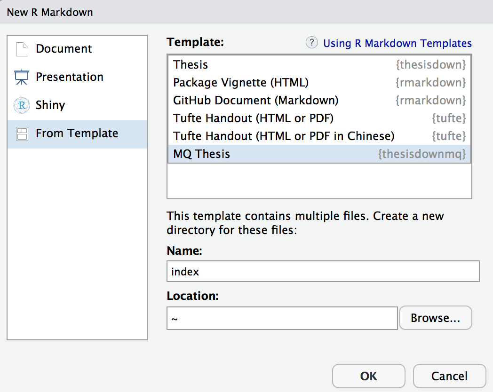

# thesisdownmq

This project was inspired by the bookdown and thesisdown packages.

Currently, the PDF version is fully-functional. (The word, gitbook and epub versions are developmental, have no templates behind them, and are essentially calls to the appropriate functions in bookdown.)

Under the hood, the Reed College LaTeX template was updated to ensure that documents conform precisely to submission standards at Macquarie University. At the same time, composition and formatting can be done using lightweight markdown syntax, and R code and its output can be seamlessly included using rmarkdown.

Using **thesisdownmq** has some prerequisites which are described below. To compile PDF documents using **R**, you are going to need to have LaTeX installed. It can be downloaded for Windows at http://http://miktex.org/download and for Mac at http://tug.org/mactex/mactex-download.html. Follow the instructions to install the necessary packages after downloading the (somewhat large) installer files. You may need to install a few extra LaTeX packages on your first attempt to knit as well.

If you are simply looking for a Macquarie University thesis LaTeX template, you should check this out: https://github.com/aalexei/mqthesis.

### Using thesisdowndmq from Thomas Fung's GitHub

To use **thesisdowndmq** from within RStudio:

1) Install the latest RStudio and rmarkdown.

2) Install the **bookdown** and **thesisdownmq** packages:

```S
# install.packages("pak")
pak::pak(c("bookdown", "thomas-fung/thesisdownmq"))
```

`pak` offers an alternative to `install.packages()` and `devtools::install_github()`. `pak` is fast, safe and convenient.

3) Use the New R Markdown dialog to select MQ Thesis:



Note that this will currently only Knit if you name the directory index as shown above.

4) Knit the index.Rmd file to get the book in PDF format.

5) Edit the individual chapter R Markdown files as you wish and then re-run step (4) again.

## How to cite 

```bibtex
@misc{thesisdownmq2019,
  author = {Fung, Thomas and Wishart, Justin},
  title = {thesisdownmq},
  year = {2019},
  publisher = {GitHub},
  journal = {GitHub repository},
  howpublished = {\url{https://github.com/thomas-fung/thesisdownmq}}
}
```

*NOTE: If you've used this template to write your thesis, drop me a line at thomas.fung.dr@gmail.com and I'll add a link to showcase it!*

### This template would satisfy the following formating requirement 

#### Presentation and formatting
- in A4 pdf format
- 1.5 spacing
- meant to be printed as one-sided
- margins of at least 3cm on the left border, at least 1.5cm on the right border and at least 1.5cm on the top and bottom
- pages numbered consecutively


#### Preliminary pages

The preliminary pages will be organised in the following order (some items can be removed):

- A title page with:
    - the thesis title
    - your names and degrees
    - your university department
    - date of submission/re-submission.
- a table of content
- a list of tables
- a list of figures
- an abstract 
- A signed statement of originality (following this [template](https://students.mq.edu.au/__data/assets/word_doc/0004/1141276/statement-of-originality-example.docx))
    - **you will have to add in your own Ethics Committee approval and protocol number (if applicable)**
- acknowledgement
- the written component of the thesis

